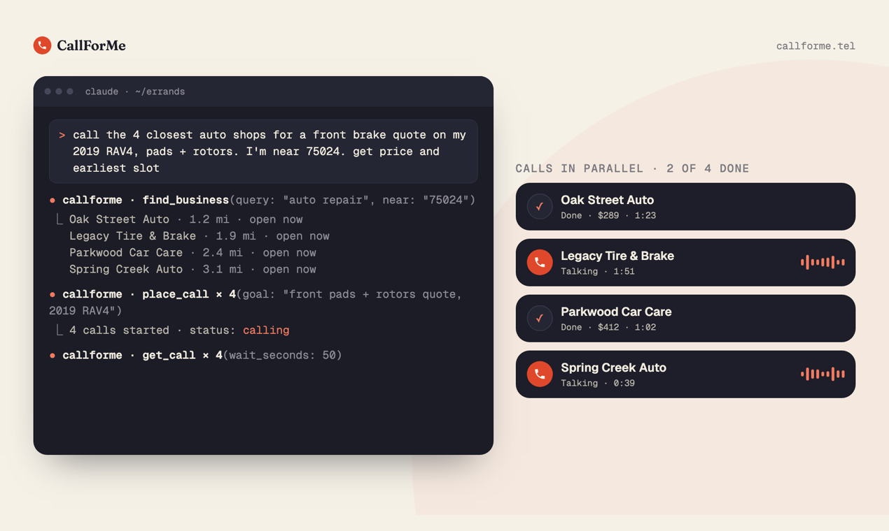

# CallForMe

CallForMe is a remote MCP server that lets your AI agent phone US and Canadian businesses for you: quotes, reservations, appointments, cancellations, stock checks and waiting on hold. A voice assistant places the call, asks your agent mid-call when the business needs something, and returns the answers plus a transcript. $1 per answered call.

**Works with:** Claude (claude.ai, Desktop, mobile), Claude Code, ChatGPT, Codex, Cursor, Gemini CLI, Windsurf, VS Code, Cline, Goose and any MCP client. Agents without MCP use the skill with the REST API.

- Website: https://callforme.tel
- MCP server: `https://callforme.tel/mcp` (OAuth that asks for nothing)
- Agent Skill: [`skills/callforme/SKILL.md`](skills/callforme/SKILL.md) (also at https://callforme.tel/skill.md)
- REST API: https://callforme.tel/docs/rest-api
- Official MCP Registry: `tel.callforme/callforme`



## What you can ask

- "Call the 3 closest auto shops and get brake quotes for my 2019 RAV4." (finds them and calls in parallel)
- "Book a table for 4 at 7:30 on Friday."
- "Cancel my gym membership and get the confirmation number."
- "Sit on hold with the airline and patch me in when a person answers."
- "Call 10 pharmacies near me and ask who has my prescription in stock."

Every call opens with "Hi, this is an AI assistant calling for [your name], on a recorded line." It switches to Spanish on its own and calls back in other languages when the business speaks one.

## Install

| Agent | How |
|---|---|
| Claude (claude.ai, desktop, mobile) | Settings → Connectors → Add custom connector → `https://callforme.tel/mcp` |
| Claude Code | `claude mcp add --transport http callforme https://callforme.tel/mcp` |
| Claude plugin (skill + connector) | This repository is a Claude plugin: `.claude-plugin/plugin.json` bundles the skill with the remote MCP server |
| ChatGPT | Settings → Security and login → Developer mode on, then chatgpt.com/plugins → + → Create custom MCP server → Create MCP App → `https://callforme.tel/mcp`, OAuth |
| Codex | `codex mcp add callforme --url https://callforme.tel/mcp` |
| Gemini CLI | `gemini mcp add --transport http callforme https://callforme.tel/mcp` |
| Cursor, Windsurf, VS Code, Cline, Goose, others | Add a remote MCP server with URL `https://callforme.tel/mcp` |
| Agents with a shell but no MCP | Use the skill in `skills/callforme/` with the REST API |

More: https://callforme.tel/agents

## Install the skill in any agent

[](https://skills.sh/callforme-tel/callforme/callforme)

```shell
npx skills add callforme-tel/callforme        # this project (asks which agents)
npx skills add callforme-tel/callforme -g     # user-level, every project
```

Where the skill lands (to install by hand, copy `skills/callforme/` there):

| Agent | Project folder | User folder (`-g`) |
|---|---|---|
| Claude Code | `.claude/skills/callforme/` | `~/.claude/skills/callforme/` |
| Codex | `.agents/skills/callforme/` | `~/.codex/skills/callforme/` |
| Cursor | `.agents/skills/callforme/` | `~/.cursor/skills/callforme/` |
| GitHub Copilot | `.agents/skills/callforme/` | `~/.copilot/skills/callforme/` |
| Gemini CLI | `.agents/skills/callforme/` | `~/.gemini/skills/callforme/` |
| OpenCode | `.agents/skills/callforme/` | `~/.config/opencode/skills/callforme/` |
| Cline | `.agents/skills/callforme/` | `~/.agents/skills/callforme/` |
| Windsurf | `.windsurf/skills/callforme/` | `~/.codeium/windsurf/skills/callforme/` |
| Goose | `.goose/skills/callforme/` | `~/.config/goose/skills/callforme/` |
| OpenClaw | `skills/callforme/` | `~/.openclaw/skills/callforme/` |

The skill tells your agent when and how to use CallForMe; the MCP server does the work, so connect that too (see Install above).

## Try it free

Five fictional businesses (a pizza place, three auto shops and a gym) can be called for free with no setup: https://callforme.tel/demo

## Pricing

$1 per answered call, including the first 2 minutes, then $0.40 a minute. No charge if nobody answers or the line is busy, and voicemail is free when the call goes straight to it. Prepaid: the first real call shows a one-time link to add $10 through Stripe; auto-reload is on by default and adjustable. Details: https://callforme.tel/docs/pricing

## Safety

- Calls only go to businesses in the US and Canada. Emergency and premium-rate numbers are blocked.
- No calls between 10pm and 7am at the business, unless you say it's open (24-hour places).
- Card numbers, security codes, one-time codes and passwords are never read to a business.
- Businesses can opt out at https://callforme.tel/for-businesses or by asking on a call.

## Support

hello@greatwork.company. CallForMe is made by Great Work LLC.

## License

The skill and the files in this repository are MIT licensed. The CallForMe service itself is hosted and is not open source.

<sub>Last updated: 2026-10-09</sub>
